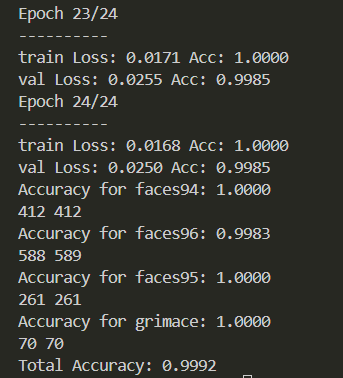
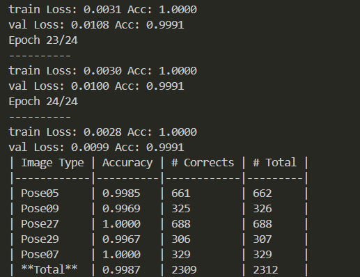

## DNN method

### FR dataset: 
run: `python dnn-fr.py`



```sh
/home/sy/anaconda3/lib/python3.8/site-packages/torchvision/models/_utils.py:208: UserWarning: The parameter 'pretrained' is deprecated since 0.13 and may be removed in the future, please use 'weights' instead.
  warnings.warn(
/home/sy/anaconda3/lib/python3.8/site-packages/torchvision/models/_utils.py:223: UserWarning: Arguments other than a weight enum or `None` for 'weights' are deprecated since 0.13 and may be removed in the future. The current behavior is equivalent to passing `weights=ResNet18_Weights.IMAGENET1K_V1`. You can also use `weights=ResNet18_Weights.DEFAULT` to get the most up-to-date weights.
  warnings.warn(msg)
Epoch 0/24
----------
train Loss: 4.4238 Acc: 0.3642
val Loss: 2.6147 Acc: 0.8063
Epoch 1/24
----------
train Loss: 1.8478 Acc: 0.9191
val Loss: 1.1410 Acc: 0.9610
Epoch 2/24
----------
train Loss: 0.7670 Acc: 0.9906
val Loss: 0.4365 Acc: 0.9955
Epoch 3/24
----------
train Loss: 0.3494 Acc: 0.9989
val Loss: 0.2286 Acc: 0.9985
Epoch 4/24
----------
train Loss: 0.1969 Acc: 1.0000
val Loss: 0.1395 Acc: 0.9985
Epoch 5/24
----------
train Loss: 0.1290 Acc: 1.0000
val Loss: 0.1063 Acc: 0.9985
Epoch 6/24
----------
train Loss: 0.0958 Acc: 1.0000
val Loss: 0.0871 Acc: 0.9985
Epoch 7/24
----------
train Loss: 0.0762 Acc: 1.0000
val Loss: 0.0719 Acc: 0.9985
Epoch 8/24
----------
train Loss: 0.0632 Acc: 1.0000
val Loss: 0.0635 Acc: 0.9985
Epoch 9/24
----------
train Loss: 0.0536 Acc: 1.0000
val Loss: 0.0550 Acc: 0.9985
Epoch 10/24
----------
train Loss: 0.0466 Acc: 1.0000
val Loss: 0.0532 Acc: 0.9985
Epoch 11/24
----------
train Loss: 0.0410 Acc: 1.0000
val Loss: 0.0465 Acc: 0.9985
Epoch 12/24
----------
train Loss: 0.0376 Acc: 1.0000
val Loss: 0.0447 Acc: 0.9985
Epoch 13/24
----------
train Loss: 0.0331 Acc: 1.0000
val Loss: 0.0409 Acc: 0.9985
Epoch 14/24
----------
train Loss: 0.0300 Acc: 1.0000
val Loss: 0.0383 Acc: 0.9985
Epoch 15/24
----------
train Loss: 0.0282 Acc: 1.0000
val Loss: 0.0369 Acc: 0.9985
Epoch 16/24
----------
train Loss: 0.0257 Acc: 1.0000
val Loss: 0.0361 Acc: 0.9985
Epoch 17/24
----------
train Loss: 0.0251 Acc: 1.0000
val Loss: 0.0329 Acc: 0.9985
Epoch 18/24
----------
train Loss: 0.0225 Acc: 1.0000
val Loss: 0.0319 Acc: 0.9985
Epoch 19/24
----------
train Loss: 0.0213 Acc: 1.0000
val Loss: 0.0308 Acc: 0.9985
Epoch 20/24
----------
train Loss: 0.0200 Acc: 1.0000
val Loss: 0.0295 Acc: 0.9985
Epoch 21/24
----------
train Loss: 0.0189 Acc: 1.0000
val Loss: 0.0274 Acc: 0.9985
Epoch 22/24
----------
train Loss: 0.0181 Acc: 1.0000
val Loss: 0.0272 Acc: 0.9985
Epoch 23/24
----------
train Loss: 0.0171 Acc: 1.0000
val Loss: 0.0255 Acc: 0.9985
Epoch 24/24
----------
train Loss: 0.0168 Acc: 1.0000
val Loss: 0.0250 Acc: 0.9985
Accuracy for faces94: 1.0000
412 412
Accuracy for faces96: 0.9983
588 589
Accuracy for faces95: 1.0000
261 261
Accuracy for grimace: 1.0000
70 70
Total Accuracy: 0.9992
```


### PIE dataset: 

run: `python dnn-pie.py`



```sh
/home/sy/anaconda3/lib/python3.8/site-packages/torchvision/models/_utils.py:208: UserWarning: The parameter 'pretrained' is deprecated since 0.13 and may be removed in the future, please use 'weights' instead.
  warnings.warn(
/home/sy/anaconda3/lib/python3.8/site-packages/torchvision/models/_utils.py:223: UserWarning: Arguments other than a weight enum or `None` for 'weights' are deprecated since 0.13 and may be removed in the future. The current behavior is equivalent to passing `weights=ResNet18_Weights.IMAGENET1K_V1`. You can also use `weights=ResNet18_Weights.DEFAULT` to get the most up-to-date weights.
  warnings.warn(msg)
Epoch 0/24
----------
train Loss: 2.2395 Acc: 0.5858
val Loss: 0.4675 Acc: 0.9619
Epoch 1/24
----------
train Loss: 0.2193 Acc: 0.9912
val Loss: 0.0999 Acc: 0.9965
Epoch 2/24
----------
train Loss: 0.0632 Acc: 0.9990
val Loss: 0.0513 Acc: 0.9974
Epoch 3/24
----------
train Loss: 0.0333 Acc: 1.0000
val Loss: 0.0359 Acc: 0.9991
Epoch 4/24
----------
train Loss: 0.0230 Acc: 1.0000
val Loss: 0.0297 Acc: 0.9991
Epoch 5/24
----------
train Loss: 0.0171 Acc: 1.0000
val Loss: 0.0251 Acc: 0.9991
Epoch 6/24
----------
train Loss: 0.0136 Acc: 1.0000
val Loss: 0.0216 Acc: 0.9991
Epoch 7/24
----------
train Loss: 0.0115 Acc: 1.0000
val Loss: 0.0208 Acc: 0.9991
Epoch 8/24
----------
train Loss: 0.0096 Acc: 1.0000
val Loss: 0.0179 Acc: 0.9991
Epoch 9/24
----------
train Loss: 0.0085 Acc: 1.0000
val Loss: 0.0175 Acc: 0.9991
Epoch 10/24
----------
train Loss: 0.0072 Acc: 1.0000
val Loss: 0.0161 Acc: 0.9991
Epoch 11/24
----------
train Loss: 0.0067 Acc: 1.0000
val Loss: 0.0153 Acc: 0.9991
Epoch 12/24
----------
train Loss: 0.0061 Acc: 1.0000
val Loss: 0.0154 Acc: 0.9991
Epoch 13/24
----------
train Loss: 0.0056 Acc: 1.0000
val Loss: 0.0133 Acc: 0.9991
Epoch 14/24
----------
train Loss: 0.0050 Acc: 1.0000
val Loss: 0.0137 Acc: 0.9991
Epoch 15/24
----------
train Loss: 0.0048 Acc: 1.0000
val Loss: 0.0127 Acc: 0.9991
Epoch 16/24
----------
train Loss: 0.0044 Acc: 1.0000
val Loss: 0.0122 Acc: 0.9991
Epoch 17/24
----------
train Loss: 0.0042 Acc: 1.0000
val Loss: 0.0116 Acc: 0.9991
Epoch 18/24
----------
train Loss: 0.0038 Acc: 1.0000
val Loss: 0.0115 Acc: 0.9991
Epoch 19/24
----------
train Loss: 0.0036 Acc: 1.0000
val Loss: 0.0120 Acc: 0.9991
Epoch 20/24
----------
train Loss: 0.0034 Acc: 1.0000
val Loss: 0.0109 Acc: 0.9991
Epoch 21/24
----------
train Loss: 0.0032 Acc: 1.0000
val Loss: 0.0120 Acc: 0.9991
Epoch 22/24
----------
train Loss: 0.0031 Acc: 1.0000
val Loss: 0.0108 Acc: 0.9991
Epoch 23/24
----------
train Loss: 0.0030 Acc: 1.0000
val Loss: 0.0100 Acc: 0.9991
Epoch 24/24
----------
train Loss: 0.0028 Acc: 1.0000
val Loss: 0.0099 Acc: 0.9991
| Image Type | Accuracy | # Corrects | # Total |
|------------|----------|------------|---------|
| Pose05     | 0.9985   | 661        | 662     |
| Pose09     | 0.9969   | 325        | 326     |
| Pose27     | 1.0000   | 688        | 688     |
| Pose29     | 0.9967   | 306        | 307     |
| Pose07     | 1.0000   | 329        | 329     |
| **Total**  | 0.9987   | 2309       | 2312    |
```